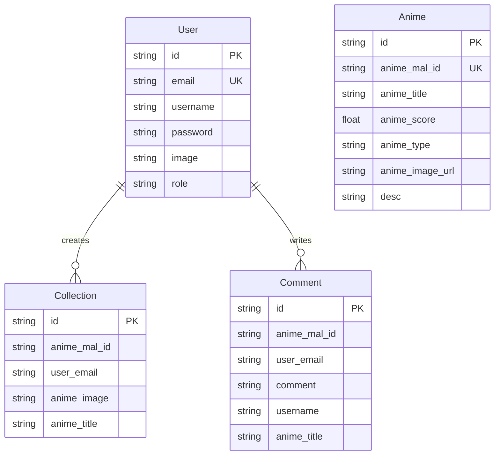

# JUST-A Admin Dashboard

A comprehensive admin dashboard for managing anime listings, user accounts, collections, and comments. Built with Next.js 14, this application provides a complete administrative interface for an anime catalog system.

## Features

### Core Functionality
- **User Management**: Create, edit, and delete user accounts with role-based access control
- **Anime Management**: Add and manage anime entries from multiple sources (Top Airing, Spring Season, Popular)
- **Collection Management**: Monitor and manage user anime collections
- **Comment Moderation**: Review and moderate user comments across anime entries
- **Authentication**: Secure credential-based authentication with NextAuth.js
- **Role-Based Access**: Admin and user role differentiation

### Technical Features
- Server-side rendering with Next.js 14
- MongoDB database with Prisma ORM
- Responsive UI with Tailwind CSS
- Real-time data updates
- Animated transitions with Framer Motion
- Protected routes with middleware
- RESTful API endpoints

## Tech Stack

- **Framework**: Next.js 14.2.13
- **Database**: MongoDB
- **ORM**: Prisma 5.19.1
- **Authentication**: NextAuth.js 4.24.7
- **Styling**: Tailwind CSS 3.4.1
- **UI Components**: Headless UI 2.1.9
- **Icons**: Phosphor Icons 2.1.7
- **Animations**: Framer Motion 11.5.6
- **Password Hashing**: bcryptjs 2.4.3

## Prerequisites

- Node.js (v18 or higher)
- MongoDB database
- npm or yarn package manager

## Installation

### 1. Clone the Repository

```bash
git clone https://github.com/idmaja/JUST-A-ADMIN.git
cd JUST-A-ADMIN
```

### 2. Install Dependencies

```bash
npm install
```

### 3. Environment Configuration

Create a `.env` file in the root directory:

```env
NEXTAUTH_SECRET=your_nextauth_secret_key
NEXTAUTH_URL=http://localhost:3001
DATABASE_URL=your_mongodb_connection_string
NEXT_PUBLIC_API_BASE_URL=https://api.jikan.moe/v4
```

### 4. Database Setup

Generate Prisma client:

```bash
npx prisma generate
```

Push the schema to your database:

```bash
npx prisma db push
```

### 5. Run Development Server

```bash
npm run dev
```

The application will be available at [http://localhost:3000](http://localhost:3000)

To run on a specific port:

```bash
$env:PORT=3001; npm run dev
```

## Database Schema



## API Routes

### Authentication
- `POST /api/auth/[...nextauth]` - NextAuth.js authentication endpoints

### Admin - Users
- `POST /api/v1/admin/users` - Create new user
- `PUT /api/v1/admin/users/[id]` - Update user
- `DELETE /api/v1/admin/users/[id]` - Delete user

### Admin - Anime
- `GET /api/v1/admin/animes` - Fetch all anime
- `POST /api/v1/admin/animes` - Create anime entry
- `PUT /api/v1/admin/animes` - Update anime entry
- `DELETE /api/v1/admin/animes/[id]` - Delete anime entry

### Admin - Collections
- `DELETE /api/v1/admin/collection/[id]` - Delete collection entry

### Admin - Comments
- `DELETE /api/v1/admin/comments/[id]` - Delete comment

## Project Structure

```
just-a-admin/
├── prisma/
│   ├── schema.prisma
│   └── migrations/
├── public/
│   └── just-a-logo.svg
├── src/
│   ├── app/
│   │   ├── admin/
│   │   │   └── dashboard/
│   │   │       ├── animes/
│   │   │       ├── collection/
│   │   │       ├── comments/
│   │   │       └── users/
│   │   ├── api/
│   │   │   ├── auth/
│   │   │   └── v1/admin/
│   │   ├── auth/
│   │   │   └── login/
│   │   ├── globals.css
│   │   ├── layout.jsx
│   │   └── page.jsx
│   ├── components/
│   │   ├── Dashboard/
│   │   │   ├── Anime/
│   │   │   ├── Collection/
│   │   │   ├── Comment/
│   │   │   ├── User/
│   │   │   └── Header.jsx
│   │   └── Utilities/
│   │       ├── DeleteModal.jsx
│   │       ├── Pagination.jsx
│   │       └── SuccessModal.jsx
│   ├── services/
│   │   ├── api-service.js
│   │   ├── auth-service.js
│   │   └── prisma.js
│   └── middleware.js
├── .env
├── .gitignore
├── next.config.mjs
├── package.json
├── postcss.config.mjs
└── tailwind.config.js
```

## Building for Production

```bash
npm run build
```

Start the production server:

```bash
npm start
```

## Deployment

### Vercel Deployment

The easiest deployment method is through Vercel:

1. Push your code to GitHub
2. Import the project in Vercel
3. Configure environment variables
4. Deploy

For detailed instructions, visit the [Next.js deployment documentation](https://nextjs.org/docs/deployment).

## Security Considerations

- All admin routes are protected by authentication middleware
- Passwords are hashed using bcryptjs
- Admin users cannot be deleted through the interface
- Environment variables are used for sensitive data
- API routes validate user permissions

## License

This project is licensed under the Creative Commons Attribution-NonCommercial 4.0 International Public License.

## Data Source

Anime data is fetched from the [Jikan API](https://jikan.moe/), an unofficial MyAnimeList API.

## Contributing

This is a private educational project. For any inquiries, please contact the repository owner.

## Support

For issues or questions, please open an issue in the GitHub repository.